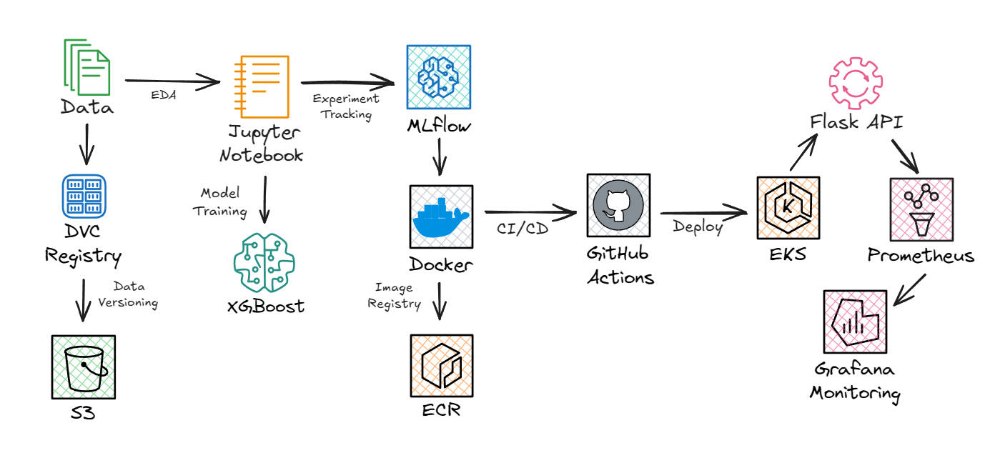
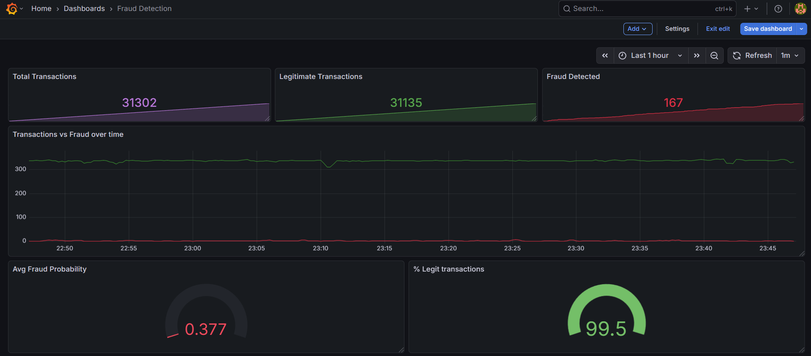

## Banking Fraud Detection System

An end-to-end MLOps pipeline for detecting fraudulent financial transactions using the PaySim synthetic mobile money dataset. The system combines machine learning with production engineering practices - from data versioning and experiment tracking to containerized deployment on AWS EKS with real-time Prometheus/Grafana monitoring.



---

## Tech Stack

| Layer | Tools |
|---|---|
| ML | XGBoost, Scikit-learn |
| Experiment Tracking | MLflow, DagsHub |
| Data Versioning | DVC, AWS S3 |
| Model Serving | Flask, Gunicorn |
| Monitoring | Prometheus, Grafana |
| CI/CD | GitHub Actions |
| Containerization | Docker, AWS ECR |
| Cloud | AWS S3, EC2, EKS |

---

### Model Results

| Model | ROC-AUC | Recall | PR-AUC |
|---|---|---|---|
| Logistic Regression | 0.977 | 0.88 | 0.54 |
| Random Forest | 0.998 | 0.78 | 0.83 |
| **XGBoost (tuned)** | **0.998** | **0.96** | **0.86** |

### XGBoost Configuration
- `max_depth=4`, `learning_rate=0.05`, `n_estimators=200`
- `min_child_weight=50` — prevents overfitting on rare fraud samples
- `scale_pos_weight=773` — handles 0.13% class imbalance
- `tree_method=hist` — fast histogram-based training
- **Decision threshold: 0.9084** — tuned via precision-recall curve for optimal F1

---

### Fraud Detection Pattern

The model identifies fraudulent transactions by detecting patterns where origin account balances are completely wiped while destination balances remain unchanged - a signature pattern of account takeover fraud. The model learned that fraud in TRANSFER/CASH_OUT transactions follows:
- Origin balance completely wiped (`balance_diff_orig` = amount)
- Destination balance unchanged (`balance_diff_dest` = 0)

---

## Monitoring



Prometheus metrics:
- `fraud_request_total` — total predictions
- `fraud_detected_total` — fraud flagged
- `legit_detected_total` — legitimate transactions
- `fraud_probability_avg` — running average probability
- `fraud_request_latency_seconds` — response latency

---

## CI/CD + Deployment

### GitHub Actions Pipeline
Every push to `main` triggers the following workflow automatically:

1. **Test** — runs `pytest tests/ -v` across model and app tests
2. **Build** — builds Docker image using `python:3.10-slim` base
3. **Push** — authenticates with AWS and pushes image to ECR (`fraud-detection:latest`)
4. **Deploy** — EKS pulls latest image and rolls out updated pods

### AWS Infrastructure
- **ECR** — stores versioned Docker images (`fraud-detection:latest`)
- **EKS** — Kubernetes cluster runs Flask app as pods with auto-scaling
- **docker-compose** — local and EC2 orchestration of Flask + Prometheus + Grafana

### Kubernetes Flow
```
GitHub Actions → docker build → ECR push → EKS pull → Flask pods → /metrics → Prometheus → Grafana
```

---

## Experiment Tracking

[DagsHub MLflow](https://dagshub.com/jayast29/ml-fraud-detection)